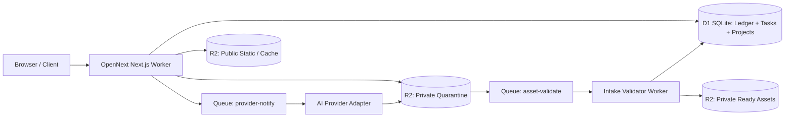

# HomeDesign

> AI-powered interior, exterior, and multi-stage floor plan visualization platform built with Next.js (App Router, Turbopack) and OpenNext on Cloudflare Workers.

---

## Architecture Overview

HomeDesign runs on an edge-native Cloudflare stack with an OpenNext Next.js runtime, storage-first asset quarantine, double-entry credit ledger, and isolated worker queues.



### Core Invariants

1. **Double-Entry Credit Ledger**: Append-only ledger tracks every grant, mock payment, hold, usage, and release. Available credits = balance minus active holds.
2. **Credit Hold Lifecycle**: An AI task admission atomically places a credit hold. The hold settles to `usage` only after output asset validation reaches `ready`. On terminal failure or timeout, the hold releases back to available credits.
3. **Storage-First Quarantine**: Uploaded source and generated assets land in private R2 quarantine first (`pending-upload` $\to$ `quarantined`). They advance to `ready` only after strict intake validation (magic bytes, dimensions, 50 MP/12,000 px limit).
4. **Provider Abstraction**: All AI operations route through `ProviderAdapter` (`FakeProviderAdapter` for offline dev/tests, `GeminiFlashImageAdapter` connecting to `https://cliproxy.monet.uno/v1` with `gemini-3.1-flash-image`).
5. **Private by Default**: Assets and projects are private. Sharing is handled strictly via unlisted, revocable tokens that only expose selected ready assets from the active lineage.

---

## Key Features

- **AI Interior & Exterior Redesign**: Upload room or house photos (up to 50MB, PNG/JPEG), choose style presets (Modern Warm, Japandi, Scandinavian, etc.), room type, color palette, aspect ratio, and custom prompt requirements.
- **AI Floor Plan Pipeline**: Room-centric multi-stage visualization workflow:
  1. *Floor Plan Source Upload*: Interactive canvas to place room markers.
  2. *Room Recognition & Brief*: Room type detection, style choices, and design proposals.
  3. *2D Furniture Layout*: Annotated 2D layout generation with design rationale.
  4. *Photorealistic Render*: 3D atmospheric render from the approved 2D layout.
  5. *360° Panorama*: Equirectangular panoramic render viewable with built-in interactive viewer (Pannellum).
- **Project & Asset Library**: Project workspaces tracking lineage across iterations, asset statuses, favorites, and unlisted token-based shareable links.
- **Admin Dashboard (`/admin`)**: Role-based access control (RBAC), user directory, manual credit adjustments, system-wide task monitoring, and live AI provider health checks.
- **Offline & Testing Modes**: Local testing with `AUTH_BYPASS=1` (test guest user), mock payment flow for credit top-ups, and fake AI provider returning lightweight deterministic SVG/PNG fixtures.

---

## Tech Stack

| Layer | Technology |
|---|---|
| **Framework** | [Next.js 16](https://nextjs.org/) (App Router, Turbopack, React 19) |
| **Runtime & Edge** | [Cloudflare Workers](https://workers.cloudflare.com/) via [@opennextjs/cloudflare](https://opennext.js.org/cloudflare) |
| **Database** | [Cloudflare D1](https://developers.cloudflare.com/d1/) (SQLite at the edge with versioned SQL migrations) |
| **Storage** | [Cloudflare R2](https://developers.cloudflare.com/r2/) (Private quarantine, ready assets, public CDN, ISR cache) |
| **Messaging & Background** | [Cloudflare Queues](https://developers.cloudflare.com/queues/) (`asset-validate`, `provider-notify`) & Cron triggers |
| **Authentication** | [BetterAuth](https://www.better-auth.com/) (Email + Password with test outbox, Google OAuth for public demo) |
| **AI Generation** | Google Gemini Flash Image (`gemini-3.1-flash-image`) via CLIProxy / Mock Seam |
| **Styling** | [Tailwind CSS v4](https://tailwindcss.com/) |
| **Testing** | [Vitest](https://vitest.dev/) (Unit & `@cloudflare/vitest-pool-workers`), [Playwright](https://playwright.dev/) (E2E) |

---

## Getting Started

### Prerequisites

- **Node.js**: `22.x` or higher
- **npm**: `10.x` or higher
- **Wrangler**: `wrangler@4.x` (included in `devDependencies`)

### Installation & Local Setup

1. **Clone the repository and install dependencies**:
   ```bash
   git clone https://github.com/monet88/homedesign.git
   cd homedesign
   npm install
   ```

2. **Configure environment variables**:
   ```bash
   cp .dev.vars.example .dev.vars
   ```

   For instant UI testing without entering credentials, enable login bypass in `.dev.vars`:
   ```ini
   AUTH_BYPASS=1
   ```
   *(When active, visits automatically authenticate as `local@homedesign.dev` with test credits).*

3. **Apply local D1 database migrations**:
   ```bash
   npx wrangler d1 migrations apply homedesign --local
   ```

4. **Start the development server**:
   ```bash
   npm run dev
   ```
   Open [http://localhost:3000](http://localhost:3000) in your browser.

---

## Key URLs

| Page | URL | Description |
|---|---|---|
| **Landing** | `http://localhost:3000` | Product showcase and entry point |
| **AI Interior** | `http://localhost:3000/ai-interior-design` | Interior redesign & style transfer |
| **AI Exterior** | `http://localhost:3000/ai-exterior-design` | Exterior architecture remodeling |
| **AI Floor Plan** | `http://localhost:3000/ai-floor-plan` | Room layout, 3D render & 360° panorama |
| **Projects** | `http://localhost:3000/projects` | User design projects & sharing |
| **Assets** | `http://localhost:3000/assets` | User uploaded and generated media assets |
| **Admin** | `http://localhost:3000/admin` | User management, credits & task logs |

---

## Testing & Quality Gates

All CI verification commands can be run locally:

```bash
# Typecheck
npm run typecheck

# Code formatting & linting
npm run lint

# Unit tests (Vitest)
npm test

# Cloudflare Workers integration tests (D1 & R2 runtime pool)
npm run wrangler:test

# Deterministic Playwright E2E suite (self-provisioning)
npm run test:e2e
```

### Updating E2E Visual Snapshots

```bash
npm run test:e2e:update
```

---

## Deployment & Environments

HomeDesign supports multiple isolated Cloudflare environments configured in `wrangler.jsonc`:

| Environment | Description | Custom Domain |
|---|---|---|
| `local` | Default local emulation with D1/R2 local bindings | `localhost:3000` |
| `development` | Cloudflare dev environment | `app-dev.<account>.workers.dev` |
| `preview` | Ephemeral pull request previews | `pr-<n>-app.<account>.workers.dev` |
| `staging` | Pre-production testing environment | `app-staging.<account>.workers.dev` |
| `demo` | Public demo deployment (read-only grants, Google auth) | `https://homedesign.monet.uno` |
| `production` | Production deployment | Production domain |

### Building and Deploying to Cloudflare Workers

```bash
# Clean and compile Next.js via OpenNext
npm run build:worker

# Preview the worker bundle locally
npm run preview

# Deploy to Cloudflare Workers (default env)
npm run deploy

# Deploy to the public demo environment
npx wrangler deploy --env demo
```

---

## Project Structure

```text
homedesign/
├── .github/              # GitHub Actions CI/CD workflows
├── docs/                 # Architecture Decision Records (ADRs) & Agent Guides
│   ├── adr/              # Formal design & architectural decisions
│   └── agents/           # Agent orchestration, bootstrap & dev guidelines
├── e2e/                  # Playwright end-to-end test journeys & fixtures
├── migrations/           # D1 SQLite incremental SQL migrations
├── public/               # Static assets, icons, landing graphics
├── scripts/              # Provisioning, E2E runners, smoke tests & admin seed
├── src/
│   ├── app/              # Next.js App Router (pages & route handlers)
│   │   ├── admin/        # Admin panel dashboard & controls
│   │   ├── ai-*/         # Interior, Exterior & Floor Plan generation pages
│   │   ├── api/          # REST endpoints (auth, ai, assets, credits, admin)
│   │   ├── projects/     # Project library & gallery
│   │   └── share/        # Public unlisted token share views
│   ├── components/       # UI components (shell, design, floor-plan, landing)
│   ├── lib/              # Core domain logic
│   │   ├── ai/           # Provider adapters (Fake & Gemini Flash Image)
│   │   ├── auth/         # BetterAuth client, server & RBAC
│   │   ├── credits/      # Double-entry ledger & hold transaction logic
│   │   ├── floor-plan/   # Multi-stage floor plan state machines & lineage
│   │   └── intake/       # Storage-first validation (magic bytes, headers)
│   └── types/            # Global TypeScript ambient definitions
├── tests/                # Vitest unit & Workers runtime test suites
├── open-next.config.ts   # OpenNext configuration for Cloudflare Workers
└── wrangler.jsonc        # Cloudflare Workers bindings (D1, R2, Queues, Crons)
```

---

## License

Private & Confidential. All rights reserved.
