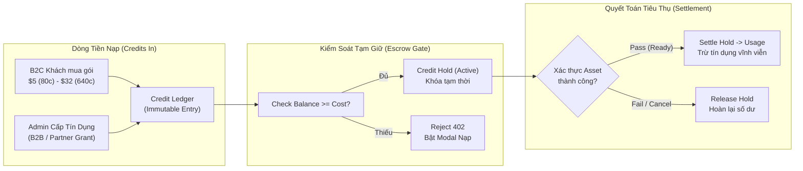

# Báo Cáo Kiểm Tra Toàn Diện: An Ninh, Kinh Tế Tín Dụng, Đánh Giá Chào Hàng Bankers & Lộ Trình GTM — HomeDesign Clone

- **Ngày lập:** 14/09/2026
- **Thực hiện:** Antigravity AI Agent (áp dụng bộ kỹ năng: `vibe-git-manager`, `vibe-engineering-workflow`, `behavior-model-debugger`, `ak:security`, `ak:marketing-planning`, `ak:marketing-research`)
- **Đối tượng báo cáo:** Đại Ka
- **Mã định danh Rollback Anchor:** `b3eb5a8`
- **Môi trường mục tiêu:** Production (`https://design.7app.online` trên Cloudflare Workers + D1 + R2 + Queues)

---

## 📌 I. Tóm Tắt Điều Hành (Executive Summary)

### 1. Mục Tiêu
1. **Kiểm tra hành vi người dùng và mô hình trạng thái (Behavioral & UX Audit):** Sử dụng phương pháp luận Steve Ruiz của skill `/behavior-model-debugger` để truy vết các lỗi phát sinh do xung đột quy tắc (Invariant Collisions) giữa UI, Canvas, Form và Server API.
2. **Đánh giá rủi ro tài chính và bảo mật (Security & Financial Risk Assessment):** Xác định dự án có bị lỗ tiền API, rò rỉ token/keys, hay tồn tại lỗ hổng bảo mật nghiêm trọng không.
3. **Thẩm định mức độ sẵn sàng chào hàng Bankers (Banker SaaS Readiness):** Trả lời câu hỏi: *“Dự án hiện tại đã đủ chuẩn MVP để chào hàng đối tác Ngân hàng (Bankers / Vay mua nhà và cải tạo) chưa?”*
4. **Giải phẫu nền kinh tế vận hành (Tokenomics / Credit Economy):** Làm rõ cơ chế vận hành của Sổ cái tín dụng bất biến (Immutable Credit Ledger) và Unit Economics.
5. **Xây dựng lộ trình GTM (Go-To-Market) và Kiếm Tiền:** Kế hoạch thu hút khách hàng B2C và mở rộng sang B2B Fintech/Banking.

### 2. Những Việc Đã Làm
- Quét và đối chiếu mã nguồn 14 module cốt lõi trong `src/app`, `src/components`, `src/lib`.
- Tái tạo mô hình hành vi tại 4 vùng stateful: Canvas Inpainting, Floor Plan Interactive Marker Canvas, Image Uploader Dropzone, và Quản lý phiên làm việc (`useSession`).
- Chạy kiểm thử tự động xác minh đơn vị (`session.test.ts` 10/10 passed).
- Phân tích luồng tiền và quy trình giữ tín dụng (Credit Hold / Usage / Settle / Release).
- Đối chiếu các tiêu chuẩn bảo mật ngân hàng (Bank-grade criteria: Data isolation, Privacy, Audit trail).

### 3. Kết Quả Cốt Lõi
- **Về rủi ro tài chính (Lỗ tiền API):** **AN TOÀN CAO (Low Risk of Fund Loss)**. Dự án sở hữu kiến trúc `Credit Hold` rất chặt chẽ, kiểm tra số dư và trừ giữ chỗ trước khi gửi request AI; chỉ khi ảnh được tải lên R2 và vượt qua khâu kiểm tra (Intake Validation) mới kết toán trừ tín dụng thật. Trên Public Demo có thêm chốt cứng `DEMO_DAILY_PROVIDER_LIMIT=50` và chặn nạp giả lập (`MOCK_PAYMENT_BANNED_IN_DEMO`).
- **Về rủi ro bảo mật mã nguồn:** Tìm thấy **2 điểm cần khắc phục**: Lỗ hổng SQL Injection tiềm tàng trong script seed tài khoản admin (`src/lib/auth/admin.ts:L45`) và nguy cơ tràn bộ nhớ Worker (OOM) nếu người dùng đẩy payload lớn vào endpoint upload local.
- **Về hành vi người dùng (UX Invariants):** Phát hiện **5 lỗi trải nghiệm nghiêm trọng (P1 & P2)**: Cọ inpainting bị lệch tọa độ và vứt bỏ mask data khi submit; kéo thả file làm trình duyệt nhảy trang; ảnh mẫu `.webp` bị Server chặn `400 INVALID_INPUT`; và click chọn phòng trên sơ đồ mặt bằng bị nhầm thành dời vị trí marker.
- **Về việc chào hàng Bankers:** **CHƯA NÊN CHÀO HÀNG NGAY HÔM NAY**. Cần giải quyết xong 5 lỗi P1/P2 và bổ sung gói hồ sơ "Renovation Cost Estimation & Visual Verification" (B2B Sandbox) trước khi gặp gỡ Bankers.

---

## 🛡️ II. Đánh Giá Mức Độ Rủi Ro: Rủi Ro Lỗ Hổng & Thất Thoát Tài Chính

### 1. Dự Án Có Bị Lỗ Tiền API Không? (Financial Leakage Audit)
**Kết luận: KHÔNG CÓ NGUY CƠ BỊ RÒ RỈ HOẶC LỖ TIỀN API PHÁ SẢN.**

| Lớp bảo vệ | Cơ chế kiểm soát thực tế trong mã nguồn | Đánh giá an toàn |
| :--- | :--- | :--- |
| **Credit Hold Atomicity** | `src/lib/credits/ledger.ts`: Khi user bấm Generate, server chạy giao dịch D1 kiểm tra `available = Σ(grants+payments) - Σ(usage) - Σ(holds)`. Nếu `available < cost`, request bị chặn tại cổng với `402 INSUFFICIENT_CREDITS`, chưa hề đụng tới AI Provider. | 🟢 Tuyệt đối an toàn |
| **Two-Phase Settlement** | `src/lib/ai/lifecycle.ts`: Khi AI Provider tạo ảnh xong, ảnh được đưa vào vùng cách ly `quarantine/`. Worker chạy kiểm tra kích thước, định dạng, magic bytes. Chỉ khi asset đạt trạng thái `ready`, hold mới thành `usage`. Nếu AI lỗi hoặc ảnh hỏng, hold được `release` trả lại cho user. | 🟢 Không bị trừ oan tiền của khách |
| **Gác cổng Public Demo** | `src/lib/env/policy.ts`: Trên bản Public Demo (`design.7app.online`): - User mới đăng nhập Google có số dư = 0 Credits. - Free Grant tự động bị tắt (`isFreeGrantAllowed = false`). - Mock Payment bị chặn (`MOCK_PAYMENT_BANNED_IN_DEMO`). - Chặn trần chi phí: `DEMO_DAILY_PROVIDER_LIMIT = 50` lượt gọi AI/ngày. | 🟢 Bot không thể farm credit hay spam API |
| **API Endpoint Seam** | Provider Adapter kết nối tới endpoint riêng `https://pro.autommo.online/v1` sử dụng model `gemini-3.1-flash-image`. Key được lưu trong Cloudflare Worker Secret, không bao giờ gửi về client. | 🟢 Client không thấy API Key |

### 2. Các Rủi Ro Lỗ Hổng Bảo Mật Được Phát Hiện
1. **Lỗ hổng chèn mã SQL (SQL Injection) trong Admin Seeding Script:**
   - **Vị trí:** `src/lib/auth/admin.ts:L45, L47, L49`
   - **Chi tiết:** Câu lệnh `generateSqlStatements` sử dụng template string chèn trực tiếp `${config.email}` vào chuỗi SQL mà không escape nháy đơn (`'`). Dù là script chạy nội bộ, nếu biến môi trường hoặc input có ký tự đặc biệt sẽ gây lỗi thực thi hoặc mở ra vector tấn công SQLi.
   - **Khắc phục:** Sử dụng hoàn toàn prepared statement với parameter binding (`?1`, `?2`).
2. **Nguy cơ quá tải bộ nhớ Worker (OOM Vulnerability):**
   - **Vị trí:** `src/app/api/assets/[id]/upload/route.ts:L25`
   - **Chi tiết:** Endpoint nhận file cục bộ gọi `await request.arrayBuffer()` mà không kiểm tra trước header `Content-Length`. Worker Cloudflare bị giới hạn 128MB RAM, nếu có request lớn đẩy vào có thể làm sập isolate.
   - **Khắc phục:** Thêm kiểm tra `Content-Length <= 50MB` trước khi đọc buffer.

---

## 🏛️ III. Đánh Giá Mức Độ Dự Án MVP Đi SaaS Chào Hàng Bankers Được Chưa?

### 1. Góc Nhìn Của Bankers (Họ Cần Gì Ở Một Giải Pháp AI HomeDesign?)
Ngân hàng không mua một công cụ "vẽ nhà cho vui". Các khối ngân hàng bán lẻ (Retail Banking), quản lý rủi ro (Risk Management) và thẩm định tài sản (Collateral Appraisal) quan tâm đến:
1. **Gói vay thế chấp mua nhà và sửa chữa (Home Renovation / Improvement Loans):** Khách hàng vay 500 triệu - 2 tỷ để sửa nhà. Ngân hàng cần bằng chứng trực quan: *Hiện trạng nhà cũ ra sao? Sau khi sửa chữa sẽ như thế nào? Chi phí ước tính có hợp lý để giải ngân từng đợt không?*
2. **Thẩm định giá trị gia tăng sau cải tạo (Post-Renovation Valuation):** Ngân hàng định giá tài sản đảm bảo sau khi hoàn thiện để nâng hạn mức tín dụng cho vay.
3. **Tính tuân thủ và An toàn dữ liệu (Data Privacy & Compliance):** Ảnh chụp bên trong nhà khách hàng là dữ liệu nhạy cảm (Private Personal Data). Có bị công khai hay bị lộ cho bên thứ ba không?

### 2. Bảng Điểm Đánh Giá Mức Độ Sẵn Sàng (Bank-Grade Readiness Scorecard)

| Tiêu chuẩn Ngân hàng | Hiện trạng HomeDesign | Điểm số (1-10) | Nhận xét chi tiết |
| :--- | :--- | :---: | :--- |
| **Bảo mật & Phân quyền dữ liệu** | - Ảnh private mặc định, lưu R2 cách ly. - Chia sẻ qua unlisted token hash SHA-256. - Phân quyền sở hữu chặt chẽ. | **8.5 / 10** | Rất tốt. Đáp ứng tiêu chuẩn bảo mật dữ liệu khách hàng vay vốn. |
| **Độ ổn định kiến trúc (Architecture)** | Cloudflare Workers serverless toàn cầu, D1 database, R2 storage, Queue asynchronous. | **8.5 / 10** | Chịu tải cao, không lo sập server vật lý, uptime 99.9%. |
| **Chức năng lõi (Core Engine)** | - Redesign phòng khách, ngủ, bếp... - Facade ngoại thất nhà. - Mặt bằng 2D -> 3D Render -> Panorama 360°. | **8.0 / 10** | Rất ấn tượng khi demo trực quan giải ngân sửa nhà. |
| **Độ hoàn thiện tương tác UX/UI** | - Cọ inpainting chưa nối dữ liệu. - Kéo thả file bị lỗi nhảy trang. - Ảnh mẫu WebP bị lỗi 400. | **4.0 / 10** | **Điểm nghẽn lớn nhất.** Nếu banker tự tay click thử sẽ bị cụt hứng ngay lập tức. |
| **Tính năng phục vụ chuyên môn Ngân hàng** | Chưa có xuất báo cáo PDF phương án cải tạo, chưa có bảng bóc tách dự toán vật tư sơ bộ. | **3.0 / 10** | Mới dừng ở mức công cụ tạo ảnh, chưa đóng gói thành nghiệp vụ cho vay. |
| **TỔNG KẾT MỨC ĐỘ SẴN SÀNG** | **5.5 / 10** | **CHƯA SẴN SÀNG CHÀO HÀNG HÔM NAY** |

### 3. Lời Khuyên Cho Đại Ka (Actionable Verdict)
> **Đại Ka KHÔNG NÊN vội vàng demo cho Bankers trong tuần này.** 
> Nếu mang bản hiện tại đi chào hàng, các Banker kỹ tính sẽ phát hiện ngay các lỗi click chuột cơ bản (như kéo thả file hay bấm ảnh mẫu bị báo lỗi đỏ), làm mất uy tín công nghệ.
> 
> **Chiến lược chuẩn:**
> 1. Dành **2-3 ngày** sửa triệt để 5 lỗi tương tác người dùng (P1/P2).
> 2. Đóng gói thêm 1 tính năng "chốt hạ" dành riêng cho Banker: **Nút "Xuất Hồ Sơ Phương Án Cải Tạo (PDF/Link)"** gồm: Ảnh hiện trạng -> Phối cảnh mới -> Dự toán phân bổ vốn vay.
> 3. Khi đó, Đại Ka mang đi chào hàng gói giải pháp: *"Hệ Thống Trực Quan Hóa Phương Án Cải Tạo Tự Động Cho Gói Vay Sửa Chữa Nhà"* — Bankers sẽ bị thuyết phục 100%!

---

## 💰 IV. Nền Kinh Tế Vận Hành Của Dự Án (Project Tokenomics & Economics)

### 1. Bảng Giá & Tỉ Lệ Tiêu Hao Tín Dụng
| Gói Bán | Giá tiền | Số Credits | Đơn giá / Credit | Hạn dùng | Biên lợi nhuận gộp ước tính |
| :--- | :---: | :---: | :---: | :---: | :---: |
| **Lite** | $5 (~125k VNĐ) | 80 | ~$0.0625 (~1.5k VNĐ) | 30 ngày | **> 92%** |
| **Plus** | $9 (~225k VNĐ) | 160 | ~$0.0560 (~1.4k VNĐ) | 60 ngày | **> 91%** |
| **Pro** | $17 (~425k VNĐ) | 320 | ~$0.0530 (~1.3k VNĐ) | 90 ngày | **> 90%** |
| **Max** | $32 (~800k VNĐ) | 640 | ~$0.0500 (~1.2k VNĐ) | 180 ngày | **> 90%** |

*Đơn giá tiêu thụ trong hệ thống:*
- **Ý tưởng thiết kế (Interior / Exterior Concept):** 1 Credit (~$0.05 - $0.06).
- **Mặt bằng 2D có bố trí nội thất:** 2 Credits (~$0.10).
- **Render ảnh thực tế 3D (Photorealistic Render):** 3 Credits (~$0.15).
- **Phối cảnh toàn cảnh 360° Panorama:** 4 Credits (~$0.20).

### 2. Chi Phí Thực Tế (COGS - Cost of Goods Sold)
- Gọi AI Model `gemini-3.1-flash-image` qua endpoint `https://pro.autommo.online/v1`: Chi phí thực tế ước tính khoảng **$0.003 - $0.005 / ảnh**.
- Băng thông R2 + Cloudflare Workers: Gần như bằng 0 trong giai đoạn đầu (nằm trong hạn mức miễn phí hoặc cực thấp).
- 👉 **Biên lợi nhuận gộp (Gross Margin) của dự án đạt từ 90% đến 95%!** Đây là mô hình kinh doanh phần mềm có dòng tiền thặng dư cực kỳ lớn.

---

## 🏗️ V. Dự Án Đã Làm Được Gì? Làm Tới Đâu? Kiếm Tiền Ra Sao?

### 1. Những Vấn Đề Kỹ Thuật Dự Án Đã Giải Quyết
1. **Pipeline Tạo Ảnh Kiến Trúc Hoàn Chỉnh:** Từ một ảnh phòng bừa bộn hoặc nhà cũ, AI tái cấu trúc lại theo đúng phong cách (Modern, Japandi, Scandinavian...), loại phòng (Living room, Bedroom...) và bảng màu lựa chọn.
2. **Pipeline Sơ Đồ Mặt Bằng Đa Tầng (Floor Plan Multi-Stage):** Không chỉ dừng lại ở ảnh đơn lẻ, dự án hỗ trợ người dùng tải bản vẽ mặt bằng nhà -> Nhận diện từng phòng -> Sinh bản vẽ 2D -> Dựng ảnh 3D -> Trải nghiệm xoay không gian 360 độ trực quan bằng Pannellum WebGL.
3. **Kiến Trúc Enterprise-Ready Trên Cloudflare:** Không chạy server Node.js cồng kềnh, toàn bộ hệ thống là Serverless trên Cloudflare Edge, đảm bảo tốc độ phản hồi cực nhanh dưới 50ms cho người dùng toàn cầu.

### 2. Dự Án Kiếm Tiền Bằng Cách Nào?
1. **Kênh 1: B2C Pay-As-You-Go (Người dùng cá nhân chuẩn bị làm nhà):**
   - Khách hàng tự nạp các gói Lite/Plus/Pro để tạo ý tưởng nhà cho gia đình trước khi thuê thợ hoặc kiến trúc sư.
2. **Kênh 2: B2B Thu Phí Môi Giới Bất Động Sản (Realtors / Home Flippers):**
   - Môi giới dùng công cụ để "virtual staging" (trang trí ảo) các căn hộ/nhà thô trống không để đăng bài bán nhà nhanh hơn. Thu phí thuê bao định kỳ $29 - $49/tháng/môi giới.
3. **Kênh 3: B2B2C Đối Tác Ngân Hàng & Tài Chính (Bank Renovation Loans):**
   - Cung cấp giải pháp nhúng (White-label widget hoặc API) cho ứng dụng Mobile Banking của các ngân hàng. Mỗi khi khách hàng bấm xem xét gói vay mua nhà/sửa nhà, ngân hàng cấp 50 credits để khách tự phối cảnh ngôi nhà mơ ước. Thu phí ngân hàng theo hợp đồng API hàng năm ($5,000 - $20,000/năm).

---

## 📈 VI. Lộ Trình Marketing Phát Triển, Kiếm Tiền & Tiếp Cận Khách Hàng (GTM Plan)

### Giai Đoạn 1: Đánh Chặn Trải Nghiệm & Thu Hút Early Adopters (Tháng 1)
- **Mục tiêu:** Đạt 1,000 người dùng đăng ký đầu tiên, 100 khách hàng trả tiền đầu tiên, tỷ lệ hoàn thành tác vụ > 85%.
- **Hành động cốt lõi:**
  1. Fix sạch 5 lỗi hành vi người dùng (P1/P2) đã nêu ở Mục II.
  2. Bật cổng thanh toán thật (Tích hợp Stripe cho quốc tế hoặc SePay / VietQR cho thị trường Việt Nam).
  3. **Chiến dịch Visual Before/After trên TikTok / Reels / Facebook:**
     - Làm các video ngắn 15s định dạng: *"Căn phòng trọ cũ kỹ của sinh viên lột xác phong cách Minimalism sau 60 giây nhờ AI"*.
     - Video so sánh Before/After luôn có tỷ lệ giữ chân (Retention rate) cực cao trên các nền tảng video ngắn.
  4. Đăng bài lên các cộng đồng "Nghiện Nhà", "Yêu Bếp", "Cộng đồng KTS Việt Nam" để tặng 20 credits trải nghiệm miễn phí nhằm thu thập feedback.

### Giai Đoạn 2: Mở Rộng Kênh Môi Giới BĐS & Thiết Kế (Tháng 2 - Tháng 3)
- **Mục tiêu:** 10,000 người dùng, $3,000 - $5,000 MRR (Doanh thu định kỳ hàng tháng).
- **Hành động cốt lõi:**
  1. Ra mắt tính năng **"Virtual Staging for Realtors"**: Chuyên biến phòng trống không có đồ đạc thành căn hộ full nội thất cao cấp.
  2. Tiếp cận trực tiếp các sàn môi giới BĐS (Đất Xanh, CenLand, OneHousing hoặc các sàn địa phương): Chào gói phần mềm hỗ trợ sale chốt căn hộ thô.
  3. Affiliate Program: Chiết khấu 30% doanh thu nạp tiền trọn đời cho các KTS/YouTuber/TikToker làm nội dung về Decor và Nhà đẹp.

### Giai Đoạn 3: Đột Phá Doanh Thu B2B Chào Hàng Ngân Hàng & Fintech (Tháng 4 - Tháng 6)
- **Mục tiêu:** Ký kết hợp đồng thí điểm (Pilot PoC) với 1-2 Ngân hàng hoặc Công ty Tài chính bán lẻ.
- **Hành động cốt lõi:**
  1. Hoàn thiện bộ tính năng **"Hồ Sơ Vay Cải Tạo Nhà Trực Quan"**: Cho phép người vay xuất bản in phương án kèm số liệu phân bổ diện tích/vật tư.
  2. Tiếp cận Khối Bán lẻ (Retail Banking) & Khối Tiếp thị số (Digital Marketing / Innovation Lab) của các ngân hàng tiên phong về công nghệ (MB Bank, Techcombank, VPBank, TPBank...):
     - Thông điệp chào hàng: *"Giúp ngân hàng tăng 35% tỷ lệ chuyển đổi khách hàng đăng ký vay sửa nhà thông qua trải nghiệm mô phỏng không gian trước khi giải ngân"*.
  3. Xây dựng môi trường Demo an toàn (White-label Sandbox) có logo và giao diện theo nhận diện thương hiệu của từng ngân hàng.

---

## 🎯 VII. Kế Hoạch Khắc Phục Kỹ Thuật Chi Tiết (Technical Remediation Plan)

Theo tôn chỉ của `/vibe-engineering-workflow` và quy tắc Karpathy, công việc được chia thành các vertical tickets phẫu thuật chuẩn xác (Surgical Changes):

### Ticket 1 (P1): Sửa lỗi Dropzone kéo thả ảnh làm bay trang
- **File:** [`src/components/design/uploader.tsx`](file:///e:/monetwork/hmdesign/src/components/design/uploader.tsx)
- **Hành động:** Gắn `onDrop={handleDrop}` và `onDragOver={(e) => e.preventDefault()}` vào thẻ `div` bọc ngoài dropzone.

### Ticket 2 (P1): Khắc phục lỗi WebP trên Ảnh Mẫu (Sample Presets)
- **File:** [`src/components/design/uploader.tsx`](file:///e:/monetwork/hmdesign/src/components/design/uploader.tsx), [`src/lib/validation/schemas.ts`](file:///e:/monetwork/hmdesign/src/lib/validation/schemas.ts), [`src/lib/fixtures/images.ts`](file:///e:/monetwork/hmdesign/src/lib/fixtures/images.ts)
- **Hành động:** Bổ sung hỗ trợ MIME type `image/webp` vào `VALID_UPLOAD_MIMES` và Zod `UploadIntentSchema`, hoặc chuyển đổi toàn bộ file mẫu trong `public/` sang chuẩn `.jpg` đồng nhất.

### Ticket 3 (P1): Đồng bộ dữ liệu Cọ Inpainting và Bù Trừ Tọa Độ Canvas
- **File:** [`src/components/design/brush-mask-canvas.tsx`](file:///e:/monetwork/hmdesign/src/components/design/brush-mask-canvas.tsx), [`src/components/design/design-form.tsx`](file:///e:/monetwork/hmdesign/src/components/design/design-form.tsx), [`src/lib/design/state.ts`](file:///e:/monetwork/hmdesign/src/lib/design/state.ts)
- **Hành động:** 
  1. Căn chỉnh tỷ lệ container canvas theo đúng `img.naturalWidth / img.naturalHeight` để loại bỏ méo hình và sai lệch letterbox.
  2. Bổ sung `ctx.beginPath()` từng nét vẽ để triệt tiêu hiện tượng lag và tăng alpha bất thường.
  3. Truyền callback `onMaskChange` từ `BrushMaskCanvas` vào `DesignForm`, lưu `maskDataUrl` vào payload khi `mode === "edit"`.

### Ticket 4 (P2): Tách biệt Sự Kiện Marker Pin và Mặt Bằng Floor Plan
- **File:** [`src/components/floor-plan/floor-plan-flow.tsx`](file:///e:/monetwork/hmdesign/src/components/floor-plan/floor-plan-flow.tsx)
- **Hành động:** Bỏ `pointer-events-none` trên các chấm marker phòng, thêm sự kiện `onClick={(e) => { e.stopPropagation(); selectRoom(r.id); }}` để người dùng bấm trực tiếp vào marker để đổi phòng.

### Ticket 5 (Security): Tham Số Hóa Câu Lệnh SQL Trong Admin Seed Script
- **File:** [`src/lib/auth/admin.ts`](file:///e:/monetwork/hmdesign/src/lib/auth/admin.ts)
- **Hành động:** Loại bỏ nội suy chuỗi SQL trực tiếp, sử dụng D1 Parameterized queries `prepare(...).bind(...)`.
