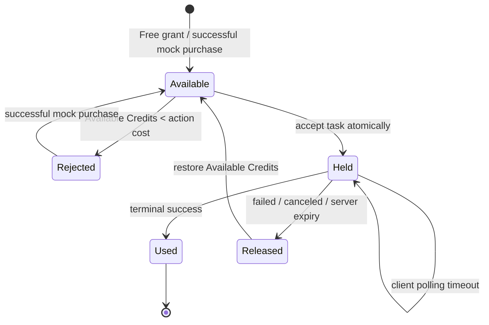

# ADR 0002 — Free-first Credits with Mock Payment

Trong giai đoạn development/staging, giữ mô hình Credits thật để kiểm thử đầy đủ quota và failure paths nhưng thay payment thật bằng Mock Payment. Mỗi user đã xác thực nhận một Free Credit Grant 10 Credits không hết hạn; chi phí theo đúng bảng model/action của origin, còn Stripe, paid-tier policy và migration sang production được hoãn tới phase payment.

**Status:** accepted

## Credit rules

- Credit Ledger là lịch sử bất biến của grant, mock purchase, hold, usage và release; không chỉnh số dư trực tiếp.
- Available Credits là số có thể sử dụng sau khi trừ các Credit Hold đang hoạt động và là số hiển thị trên badge.
- Khi server chấp nhận AI task, hệ thống atomically tạo một Credit Hold. Terminal success chốt hold thành usage; terminal failed, canceled hoặc server-side expiry giải phóng hold.
- Client polling timeout sau 120 giây không phải terminal state và không giải phóng hold. Task hoàn tất muộn vẫn settle đúng một lần.
- Task creation và Mock Payment đều idempotent. Retry cùng idempotency key không tạo task, hold, purchase hoặc Credits lần hai.
- Floor Plan tính phí độc lập theo từng stage: brief 1, layout 2, render 3, panorama 4. Stage đã thành công giữ usage; chỉ stage thất bại giải phóng hold của chính nó; retry tạo hold mới.

## Mock Payment boundary

- Development/staging mô phỏng bốn pack của origin: Lite 80, Plus 160, Pro 320 và Max 640 Credits. UI ghi rõ `Mock purchase — no charge`; Credits không hết hạn trong testing.
- Luồng bình thường mặc định success; test controls có thể tạo success, canceled hoặc failed. Chỉ success cộng Credits.
- Mock Payment dành cho mọi user đã xác thực trong development/staging, không giới hạn số lần và không dùng giới hạn IP/device.
- Khi không đủ Credits, task bị từ chối trước khi tạo, UI nêu số Credits còn thiếu và mở modal Mock Payment.
- Production không được chấp nhận Mock Payment. Mock Credits và ledger test không được mang hoặc quy đổi sang payment thật.

## State diagram

Duplicate requests return the existing task or purchase result without another state transition. Payment provider, production free-grant policy, paid-tier expiry and migration are deliberately deferred to the payment phase.
