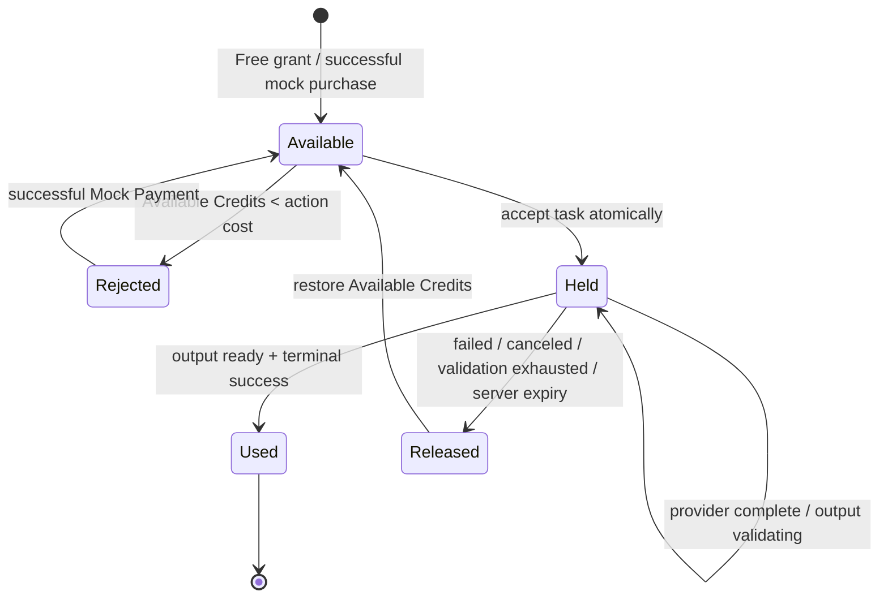

# ADR 0002 — Free-first Credits with Mock Payment

Trong local/development/PR preview/staging, giữ mô hình Credits thật để kiểm thử đầy đủ quota và failure paths nhưng thay payment thật bằng Mock Payment. Mỗi user đã xác thực nhận một Free Credit Grant 10 Credits không hết hạn; chi phí theo đúng bảng model/action của origin, còn Stripe, paid-tier policy và migration sang production được hoãn tới phase payment.

**Status:** accepted

**Revision 2026-09-07:** ADR này chỉ mô tả testing economy của local/development/PR preview/staging. Public Demo theo ADR 0008 không nhận Free Credit Grant, không expose Mock Payment và bắt đầu với 0 Credits; Credits chỉ được thêm bằng immutable Admin Credit Grant. Credit Ledger, Credit Hold, settlement/release và stage costs vẫn dùng cùng invariant hiện có.

## Credit rules

- Credit Ledger là lịch sử bất biến của grant, Mock Payment, hold, usage và release; không chỉnh số dư trực tiếp.
- Available Credits là số có thể sử dụng sau khi trừ các Credit Hold đang hoạt động và là số hiển thị trên badge.
- Khi server chấp nhận AI Task, hệ thống atomically tạo task row và một Credit Hold. Provider hoàn tất chỉ chuyển task sang output validation; terminal success chỉ xảy ra sau khi mọi Generated Asset mong đợi thành `ready` và attach thành công. Terminal failed, canceled, output validation exhausted/DLQ hoặc server-side expiry giải phóng hold.
- Client polling timeout sau 120 giây không phải terminal state và không giải phóng hold. Task hoàn tất muộn vẫn settle đúng một lần.
- Server expiry là 30 phút wall-clock từ lúc task được accept, không được gia hạn bởi client poll, provider retry hoặc reconnect. Reconciler atomically chuyển task non-terminal quá hạn thành `expired`; callback/queue delivery tới muộn chỉ được ghi nhận, không resurrect task hoặc settle hold.
- Task creation và Mock Payment đều idempotent theo unique `(user_id, operation, idempotency_key)`. Cùng key + cùng canonical request fingerprint trả record/result hiện có; cùng key + payload khác trả `409 IDEMPOTENCY_KEY_REUSED`. Record idempotency giữ cùng vòng đời domain record nên reconnect không tạo task, hold, Mock Payment hoặc Credits lần hai.
- Trong testing economy, Free Credit Grant dùng unique key `(user_id, "free-credit-grant-v1")` và được ensure trên verified session/task paths, nên email callback, Google login và reconnect đồng thời vẫn chỉ tạo một ledger entry. Public Demo không gọi path này.
- Floor Plan tính phí độc lập theo từng stage: brief 1, layout 2, render 3, panorama 4. Stage đã thành công giữ usage; chỉ stage thất bại giải phóng hold của chính nó; retry tạo hold mới.

## Mock Payment boundary

- Local/development/PR preview/staging mô phỏng bốn pack của origin: Lite 80, Plus 160, Pro 320 và Max 640 Credits. UI ghi rõ `Mock purchase — no charge`; Credits không hết hạn trong testing.
- Luồng bình thường mặc định success; test controls có thể tạo success, canceled hoặc failed. Chỉ success cộng Credits.
- Mock Payment dành cho mọi user đã xác thực trong local/development/PR preview/staging, không giới hạn số lần và không dùng giới hạn IP/device.
- Khi không đủ Credits, task bị từ chối trước khi tạo, UI nêu số Credits còn thiếu và mở modal Mock Payment.
- Public Demo và Production không được chấp nhận Mock Payment. Mock Credits và ledger test không được mang hoặc quy đổi sang Public Demo/production entitlement hay payment thật.

## State diagram

Duplicate requests return the existing task or purchase result without another state transition. Payment provider, production free-grant policy, paid-tier expiry and migration are deliberately deferred to the payment phase.
