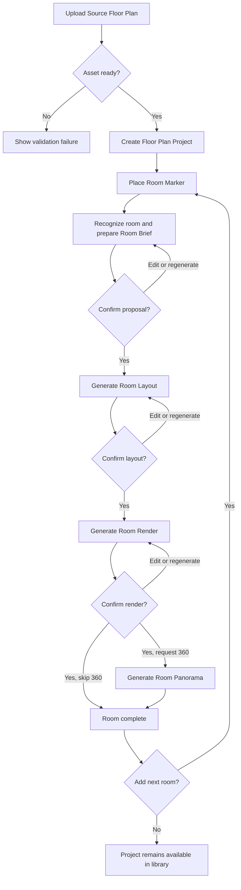

# ADR 0004 — Room-centric Floor Plan visualization pipeline

Floor Plan là một pipeline visualization tạo sinh theo từng phòng, tách khỏi Interior/Exterior image-to-image. Một Source Floor Plan tạo nhiều Room Designs theo marker; mỗi Room Design đi tuần tự qua Room Brief → Room Layout → Room Render → Room Panorama tùy chọn. Hệ thống không tái dựng CAD/BIM, không duy trì geometry editable và không gọi ảnh render là mô hình 3D.

**Status:** accepted

## Domain boundary

- `FloorPlanProject` gắn với đúng một Source Floor Plan `ready` và chứa nhiều `RoomDesign` độc lập. Thay source tạo project mới để marker và lịch sử cũ không bị diễn giải lại.
- `RoomMarker` có identity ổn định và tọa độ `{x,y}` chuẩn hóa trong khoảng 0–100. Một marker có một Room Design; các phương án khác nhau là stage runs/revisions của Room Design đó.
- Marker chỉ được đổi trước khi Room Brief được xác nhận. Sau thời điểm đó, chọn vị trí khác tạo Room Design mới; `Add Next Room` quay lại bước đặt marker mà không ảnh hưởng phòng đã làm.
- Recognition chỉ phân tích vùng người dùng chọn để suy luận room type, openings, approximate shape/layout direction và kích thước đọc được từ source. Nó không tạo wall graph, polygon có thẩm quyền, metric calibration hay hồ sơ dùng cho thi công.
- Floor Plan Processing sở hữu workflow và lineage. Asset & Project Library sở hữu storage, privacy, favorite và sharing; Credits sở hữu hold/settlement. AI provider/model là adapter theo stage, không phải thuật ngữ domain và không buộc vào contract Interior/Exterior.

## Stage contracts

| Stage | Inputs bắt buộc | Output | Gate sang stage sau | Cost |
| --- | --- | --- | --- | ---: |
| `RoomBrief` | Source + marker + nhận diện + Style + questionnaire theo room type + yêu cầu tự do | Design Proposal và room context đã chuẩn hóa | User xác nhận proposal | 1 Credit |
| `RoomLayout` | Room Brief đã xác nhận + source room context | Ảnh 2D furniture layout có chú thích | User chọn `Next Step` | 2 Credits |
| `RoomRender` | Room Layout và Room Brief đã xác nhận | Ảnh photorealistic | User chọn `Next Step` hoặc hoàn tất nếu bỏ qua 360° | 3 Credits |
| `RoomPanorama` | Lineage Room Render đã xác nhận | Ảnh equirectangular 360° | Success hoàn tất panorama | 4 Credits |

- 2D là generated design board, không có editor kéo-thả. `Edit` quay lại brief/feedback có liên quan rồi tạo run mới.
- “3D Render” là nhãn marketing cho ảnh photorealistic; không có mesh, camera graph, vật liệu editable hoặc free-walk viewer.
- 360° là một panorama tương tác cho từng phòng. Không có hotspot, navigation graph, video hay VR trong scope.
- Panorama là tùy chọn. Room Design hoàn tất khi Room Render đã được xác nhận và panorama được bỏ qua, hoặc khi Room Panorama thành công nếu user yêu cầu.
- Project Overview lấy `markedAreas`, `completeRooms` và `currentRoom` từ các Room Designs. Chuỗi `draft → analyzed → layout-ready → render-ready → panorama-ready` là progress của phòng hiện tại, không phải một global state có thể làm mất trạng thái các phòng khác.

## Runs, confirmation, and lineage

- Mỗi stage run là bất biến và có trạng thái `draft | processing | success | failed | confirmed`. `success` nghĩa là Generated Asset đã qua validation thành `ready`, attach vào Project và Credit Hold đã settle; provider completion/quarantine chưa phải success. `confirmed` nghĩa là user chọn output đó làm input cho stage kế tiếp. `stale` là quan hệ lineage được suy ra cho output downstream, không phải trạng thái của run.
- Mỗi Room Design chỉ có một run `processing` cho mỗi stage. Task creation dùng idempotency key để double-click, reconnect hoặc retry request không tạo hai run/holds.
- Regenerate luôn tạo run billable mới; không ghi đè output cũ. User có thể xem history và chọn lại một run thành công làm lineage hiện tại.
- Chỉnh hoặc regenerate upstream không xóa downstream đã sinh. Khi upstream mới được xác nhận, các output downstream thuộc lineage cũ chuyển thành `stale`, không còn là output active để tiếp tục hoặc share, nhưng vẫn giữ trong history.
- Một upstream run mới đang draft/processing/failed không phá lineage đã xác nhận trước đó. User chỉ mất downstream active sau khi chủ động xác nhận upstream replacement.
- Retry một stage thất bại không chạy lại các stage đã thành công. Failure, cancellation hoặc server expiry chỉ tác động run hiện tại; Room Design và lineage trước đó vẫn dùng được.
- Dimension chỉ xuất hiện trên Room Layout khi đọc được từ Source Floor Plan; hệ thống không bịa số đo rồi trình bày như dữ liệu kỹ thuật.

## Credits and failure behavior

- Stage acceptance tạo Credit Hold atomically; Generated Asset ready + attach mới success/settle; terminal failed/canceled/output-validation exhausted/DLQ/server expiry release riêng hold của run đó.
- Confirm, xem lại artifact, đổi current room và mở viewer không tốn Credits. Regenerate hoặc retry bằng một run mới tạo hold mới.
- Việc một upstream change làm downstream cũ stale không hoàn Credits, vì các stage đó đã hoàn tất và artifact vẫn được giữ trong history.
- Client polling timeout không phải terminal state. UI tiếp tục cho user rời trang và khôi phục trạng thái run từ server khi quay lại.
- Không đủ Credits thì stage không được tạo; các stage trước và Room Design hiện tại không thay đổi.

## Panorama media contract

- Phase đầu dùng một ảnh equirectangular 2:1 cho mỗi Room Panorama, ưu tiên 4096×2048 để cân bằng độ nét và khả năng WebGL trên thiết bị phổ thông. Orientation ban đầu được lưu cùng artifact.
- Viewer dùng Pannellum 2.5.7 qua JavaScript API với pan, zoom, drag/touch và fullscreen. Không dùng Three.js vì feature không có scene 3D; không bật tour/hotspot/video.
- Viewer nhận authorized short-lived Asset URL. Lỗi WebGL/viewer chỉ làm view tương tác unavailable; panorama artifact vẫn tồn tại và có thể hiển thị preview tĩnh.

## Flow

Một failed stage quay lại chính stage đó bằng retry; stage đã xác nhận trước nó không chạy lại. Regenerate upstream tạo lineage mới và chỉ đánh dấu downstream cũ stale sau khi replacement được xác nhận.

## Rejected alternatives

- Full floor-plan topology/CAD/BIM: vượt product promise và không xuất hiện trong flow thực tế.
- Gộp 2D, Render và Panorama thành một task: làm mất progress, retry độc lập và credit settlement theo stage.
- Editor 2D kéo-thả: video chỉ chứng minh generated layout image và feedback/regenerate.
- 3D scene hoặc Three.js: “3D” là photorealistic image; chỉ panorama cần WebGL viewer.
- Tour nhiều panorama hoặc 360° video: mỗi Room Design chỉ cần một panorama và `Add Next Room` tạo workflow phòng khác.

## Sources

- Video reference: `.ref/AI Floor Plan- Room Layouts, 3D Renders & 360° - HomeDesign.mp4`.
- Origin contract research: `research/generation-pipeline.md:69` và `research/stack-api-contract.md:34`.
- Pannellum: [overview](https://pannellum.org/documentation/overview/), [configuration reference](https://pannellum.org/documentation/reference/), [API](https://pannellum.org/documentation/api/) và [official repository](https://github.com/mpetroff/pannellum).
