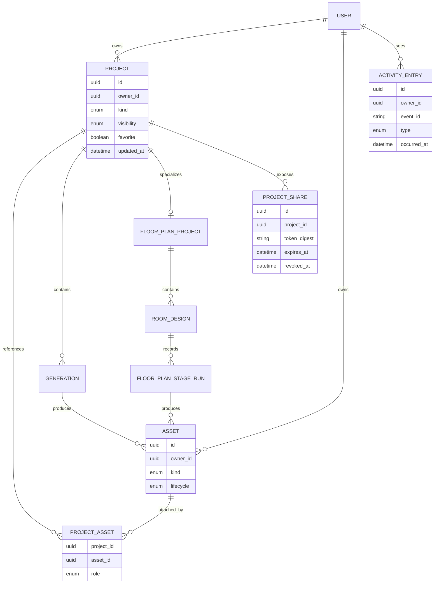

# ADR 0005 — Project library with unlisted read-only sharing

Project là aggregate duy nhất nối Generation, FloorPlanProject/RoomDesign, private Assets, favorite và sharing. Asset vẫn là ảnh thuộc user với lifecycle riêng, còn Activity là read model phục vụ timeline; cách tách này giữ privacy ở một nơi, cho Source Asset tái sử dụng và không biến raw object storage thành public surface.

**Status:** accepted

## Aggregate and attachment rules

- `Project.kind` là `interior | exterior | floor-plan`. Interior/Exterior Project gom một design intent cùng các Generations; FloorPlanProject là specialization có đúng một Source Floor Plan và nhiều Room Designs.
- Một design flow tạo draft Project khi ready Source Asset đầu tiên được dùng. Mỗi Generation hoặc Floor Plan Stage Run luôn thuộc đúng một Project; failed work vẫn để lại Project và Source Asset để retry.
- Source Asset thuộc user, có thể được nhiều Projects của chính user tham chiếu và không bị nhân bản object. Generated Asset thuộc đúng một Generation/stage run và đúng một Project.
- Project Favorite là owner preference. Visibility và Project Share chỉ tồn tại ở Project; phase đầu không favorite hoặc share riêng một Asset.
- Xóa Asset không được âm thầm phá Project khác đang tham chiếu nó: UI phải nêu số Project bị ảnh hưởng và deletion workflow thu hồi mọi access theo ADR 0003. Project deletion không xóa Source Asset còn được Project khác tham chiếu.

## Sharing and privacy

- Project mặc định `private`. Owner có thể tạo một Project Share unlisted, read-only với opaque token entropy cao; server lưu token digest thay vì secret thuần.
- Viewer không cần đăng nhập. Share response chỉ gồm metadata trình bày tối thiểu và ready Generated Assets owner đã chọn từ lineage active; Floor Plan output phải thuộc run active/confirmed và không `stale`.
- Source Assets, draft/failed/stale/history outputs, Room Brief nội bộ, object key và raw R2 URL không thuộc share surface. Mỗi ảnh được phát bằng authorized short-lived delivery theo ADR 0003; share UI không hiển thị download action.
- Ẩn download chỉ là product affordance, không phải DRM: viewer đã nhận image bytes vẫn có thể lưu, chụp màn hình hoặc dùng developer tools. Privacy guarantee đến từ asset selection, authorization, short-lived delivery, revoke và metadata tối thiểu; UI/copy không được hứa ngăn sao chép tuyệt đối.
- Share mặc định không hết hạn nhưng có optional expiry và revoke. Đổi Project về Private, xóa Project/Asset hoặc revoke Share dừng access ngay. Restore Project/Asset không tự tái kích hoạt link hoặc asset selection cũ; owner phải tạo Share/chọn asset lại.
- Favorite không ảnh hưởng privacy. View count hoặc analytics, nếu thêm sau, không được trở thành điều kiện authorization.

## Activity timeline

- Activity Entry là append-only, owner-only và idempotent theo domain event ID. Nó là timeline sản phẩm, không phải security audit log hoặc nguồn chuẩn của Credits.
- Ghi Project create/rename/favorite/visibility/share/revoke/delete/recover; Asset ready/rejected; Generation hoặc Floor Plan stage started/succeeded/failed; Mock Payment succeeded/failed.
- Không ghi polling, page view, download hoặc từng Credit Hold/settlement. Credit Ledger vẫn là nguồn chuẩn; Activity chỉ có thể trỏ tới kết quả Mock Payment cấp cao.
- Activity Entry giữ 90 ngày rồi expire. Domain lineage, Credit Ledger và deletion metadata tuân retention riêng, không phụ thuộc timeline.

## ERD

`PROJECT_ASSET.role` phân biệt `source | generated | share-selected`; unique constraints giữ một Generated Asset gắn đúng output owner, còn Source Asset có thể xuất hiện trong nhiều Projects.

## Library and query interface

- `/projects` là Project library chuẩn; sidebar `Projects` trỏ route này. `/assets` là file-level library từ account menu. `/activity` là timeline. Clone không giữ quirk hiện tại của origin khi `/projects` trả 404 và sidebar trỏ `/assets`.
- Projects hiển thị responsive grid với cover 4:3, title, kind, updated time, favorite và visibility/share badge. Assets dùng dense thumbnail grid với Source/Generated, project usage và lifecycle filters. Activity dùng chronological list; cả ba có loading skeleton, empty, error và retry states.
- Projects/Assets trả 24 items/page; Activity trả 50 entries/page. Dùng opaque cursor trên `(sort_value, id)`, stable tie-breaker và max 100; không dùng offset khi dữ liệu tăng hoặc generation hoàn tất xen kẽ.
- Project filters: `kind`, favorite, visibility và search title; sort `updated-desc` mặc định, `created-desc`, `name-asc`. Asset filters: source/generated, lifecycle, Project và created time. Activity filters: event family, outcome và time range.
- Filter/sort/search chạy server-side và reset cursor. URL query giữ state để back/forward và share nội bộ hoạt động; empty filter result khác empty account.

## Completion consistency

Project Library read model chỉ attach Generated Asset sau khi validator chuyển Asset thành `ready`. Không hiển thị optimistic completed output hoặc attach trực tiếp provider URL.

Client tiếp tục poll AI task theo contract hiện có. Khi task terminal và output ready, nó invalidate/refetch Project detail cùng first page hiện hành của Projects, Assets và Activity; focus/reconnect cũng refetch. Trong khi có task active, UI có thể poll summary nhẹ. Phase đầu không thêm WebSocket/SSE chỉ để đồng bộ library; server-side domain event vẫn cập nhật Activity/read model idempotently để một realtime adapter có thể được thêm sau mà không đổi domain interface.

## Origin compatibility note

Quan sát anonymous ngày 2026-08-25: [origin `/projects`](https://homedesigns.app/projects) trả Page not found; [origin `/assets`](https://homedesigns.app/assets) hiển thị library shell và sidebar `Projects` trỏ lại `/assets`; [origin `/activity`](https://homedesigns.app/activity) redirect tới sign-in. Clone giữ visual vocabulary nhưng chuẩn hóa route theo domain để tránh một route mang hai nghĩa.
