# ADR 0006 — Cloudflare runtime with isolated environments

Deploy HomeDesign end-to-end trên Cloudflare thay vì đặt Next.js ở Vercel rồi giữ data/workers tại Cloudflare. OpenNext Worker, D1, R2, Queues và Workflows dùng chung capability, deployment và observability plane; bốn Cloudflare accounts tách development, preview, staging và production để giảm blast radius và ngăn binding nhầm vào user data thật.

**Status:** accepted

**Revision 2026-08-26:** Bỏ Cloudflare Container khỏi phase đầu. Intake Validation chỉ đọc byte/header có giới hạn trong Worker; full image decode/re-encode là Canonicalization deferred theo ADR 0003. Workers Paid không còn là mặc định kiến trúc và chỉ được bật ở environment nào có production build/CPU/usage vượt Workers Free hoặc có yêu cầu vận hành đã đo được.

## Runtime modules and interfaces

- **App module:** Next.js/OpenNext Worker sở hữu HTTP/SSR, BetterAuth, authorization, upload intents, D1 transactions và public task/query interface. Dùng `nodejs_compat`, Node runtime của Next.js và pinned compatibility date; không dùng `export const runtime = "edge"`. Bắt đầu từ Workers Free chỉ khi production dry-run và runtime tests chứng minh compressed bundle, CPU và request usage nằm trong giới hạn; nâng Paid theo evidence thay vì mặc định.
- **Metadata module:** D1 là nguồn chuẩn cho Identity metadata, Projects/Assets, immutable stage/task lineage, Activity và Credit Ledger/Holds. Mỗi environment có database riêng, tạo với location hint `apac`.
- **Asset module:** private R2 bucket giữ `quarantine/`, ready user Assets và recovery prefixes; public R2 bucket giữ Static Media; bucket thứ ba giữ OpenNext incremental cache. Không dùng production bucket cho development/preview/staging.
- **Validation module:** R2 `object-create` gửi ID/key/ETag vào `asset-validate` Queue. Validation Worker kiểm tra actual byte size, magic bytes và bounded PNG/JPEG headers bằng R2 ranged reads, rồi stream/copy object đạt chuẩn sang private ready key. Worker không full decode raster, re-encode hoặc strip EXIF trong phase đầu.
- **Generation module:** một Cloudflare Workflow có ID bằng task ID gọi AI provider adapter, sleep/poll/retry theo failure policy và ghi provider output vào R2 quarantine. Workflow không truyền binary qua state và không để browser polling quyết định task lifecycle.
- **Delivery module:** App Worker authorize private view/share rồi phát short-lived delivery; public static media đi qua `cdn.<domain>`. Raw R2 user object không trở thành public route.

OpenNext được giữ vì origin parity và stack đã khóa. Tài liệu Cloudflare hiện ưu tiên vinext cho app mới, trong khi OpenNext upstream vẫn hỗ trợ Next.js 16 và các feature cần dùng. Vì vậy resolved Next/OpenNext/Wrangler versions, compatibility date, Linux production build và Workers-runtime integration suite là một release unit; đổi sang vinext cần compatibility spike và ADR riêng.

## Production placement

- HTTP Worker chạy global, static assets ở edge gần request. Smart Placement tắt mặc định; chỉ bật sau khi production trace chứng minh nó giảm materially D1/provider round trips.
- D1 primary dùng `--location=apac`; đây là hint, không phải residency guarantee. Read replication tắt phase đầu để giữ interface đơn giản cho BetterAuth, Credit Holds và task acceptance; chỉ bật cùng Sessions API sau benchmark và consistency tests.
- Validation Worker chạy stateless; R2/D1 là durable state. Queue concurrency và upload quotas giới hạn cost/load, còn parser bắt buộc bounded theo số byte và số JPEG segments để input xấu không biến thành unbounded CPU hoặc reads.
- Không ghi claim R2 regional residency. Nếu sau này có data-residency requirement, phải mở decision mới cho D1 jurisdiction, Regional Services, R2 policy và AI provider data handling trước khi nhận dữ liệu thuộc jurisdiction đó.

## Environment topology

```mermaid
flowchart TB
    subgraph DEV[Cloudflare account: development]
        DW[Dev Worker] --> DD[(Dev D1)]
        DW --> DR[(Dev R2)]
        DR --> DQ[Dev Queue/DLQ]
        DQ --> DV[Dev Validation Worker]
    end

    subgraph PREVIEW[Cloudflare account: preview]
        PW[PR-specific Worker] --> PD[(PR-specific D1)]
        PW --> PR[(PR-specific R2)]
        PR --> PQ[PR-specific Queue/DLQ]
        PQ --> PV[PR Validation Worker]
    end

    subgraph STAGING[Cloudflare account: staging]
        SW[Staging OpenNext Worker] --> SD[(Staging D1)]
        SW --> SR[(Staging R2)]
        SW --> SF[Staging AI Workflow]
        SR --> SQ[Staging Queue/DLQ]
        SQ --> SV[Staging Validation Worker]
    end

    subgraph PROD[Cloudflare account: production]
        U[Browser] --> W[Global OpenNext Worker]
        W --> D[(Production D1, APAC hint)]
        W --> R[(Production private/public/cache R2)]
        W --> F[Generation Workflow]
        F --> AI[External AI provider]
        AI --> R
        R --> Q[asset-validate Queue]
        Q --> V[Validation Worker]
        Q --> DLQ[Validation DLQ]
        V --> R
        V --> D
    end
```

| Environment | Exposure | Data/resources | Payment/generation rule |
| --- | --- | --- | --- |
| Local development | localhost | Wrangler-local simulations + local Validation Worker | Synthetic data; Mock Payment allowed |
| Development | Cloudflare Access-protected `workers.dev` | Dedicated dev account/resources | Synthetic data; Mock Payment allowed |
| PR preview | Access-protected PR-specific `workers.dev` | Ephemeral D1/R2/Queue/Worker, migrations + seed, destroy on close and 72-hour janitor | Synthetic data; Mock Payment; real bounded-header validation |
| Staging | Access-protected `workers.dev` | Dedicated production-shaped resources and real Validation Worker/Workflow | Disposable test data; Mock Payment allowed; full failure tests |
| Production | apex/www, `cdn.<domain>`, share routes | Dedicated prod account; real user data only | Mock Payment forbidden; generation off until production Credits/payment policy is accepted |

Static fixtures may be copied from a versioned manifest, but no environment reads another environment's private bucket, D1, Queue, secret or user export. Cloudflare version Preview URLs are not used as PR environments because they retain Worker bindings and lack the isolated data lifecycle and logs required by this topology.

## Queue, Workflow and failure policy

- Queue payloads contain IDs, object key, ETag and attempt metadata, never image bytes. Queue delivery là at-least-once, nên `AssetValidationJob.id` và state transition phải idempotent.
- Asset validation starts with a small batch, finite retries, exponential delay, explicit `max_concurrency` and mandatory DLQ. Duplicate R2 event/finalize requests converge on the same job.
- Validation Worker marks `ready` only after the ready-key copy is durable. Parser/read/copy failure keeps Asset non-ready and retries safely; poison input reaches DLQ and raises an alert, never bypasses validation.
- Workflow instance ID equals accepted task ID. Provider submit and settlement steps use task/idempotency IDs; sleeping does not release Credit Hold. Server expiry/failure releases only through the state machine in ADR 0002.
- A scheduled reconciler finds accepted tasks without a running/completed Workflow and restarts the same instance ID; client disconnect or 120-second polling timeout has no terminal effect.

## Configuration, secrets and preview lifecycle

- Wrangler configuration and checked-in provisioning scripts are source of truth. Bindings, vars and secrets are explicit per environment because Wrangler environments do not inherit them.
- Commit only `secrets.required` names. Local values live in ignored `.dev.vars*`; deployed values use environment-specific secrets. BetterAuth, Google OAuth, AI provider and Cloudflare automation credentials differ by account.
- CI tokens are least-privilege and account-scoped. Production tokens live only in a protected CI environment with approval; no development/preview job receives them.
- Each PR preview provisions resources from migrations/fixtures, runs smoke tests and records resource IDs. Close cleanup plus a scheduled janitor deletes resources older than 72 hours. It never clones production data.

## Observability and operational gates

- Enable structured Workers/Workflow logs with `request_id`, `task_id`, `asset_id`, `job_id`, attempt and deployed version. Never log email, token, opaque share secret, object credential or signed URL.
- Alert on HTTP error/CPU, D1 failures, Credit Hold age, Workflow error/stall, Queue backlog/oldest age, DLQ depth, validation error/duration/rejection spikes and R2 storage growth.
- Development/staging keep full logs. Production uses intentional head sampling plus 100% explicit error/security events; export only if native retention is insufficient.
- Build acceptance gate: test spoofed MIME/extension, truncated PNG/JPEG, malformed/late JPEG segments, oversized dimensions/pixel count, bounded range-read/CPU behavior, 50MB streaming copy, duplicate delivery, retry, DLQ and idempotent ready-key write.

## Release, rollback and cost guardrails

- Release order: validate migrations → apply backward-compatible expand migration → upload Worker version → staging smoke/failure suite → production smoke → gradual promotion. Contract cleanup occurs only after the rollback window.
- Worker rollback restores code/config version but not D1/R2 state. Keep schemas backward-compatible, retain the previous Worker version and rehearse rollback in staging. D1 Time Travel is a destructive point-in-time recovery procedure, not normal code rollback.
- Free-first release gate chạy `wrangler deploy --dry-run` và production runtime suite cho từng Worker. Compressed bundle phải không vượt 3MB và mỗi invocation phải nằm trong 10ms CPU của Workers Free; environment nào không đạt mới nâng Workers Paid, ghi lại evidence và budget owner.
- Existing per-user upload/storage quotas remain hard gates. Add Queue/Workflow concurrency, provider request/spend caps, bounded validator reads/CPU, R2 lifecycle rules and log sampling. Cloudflare budget/usage alerts notify only; they do not cap spend.
- Kill switches may reject new upload intents or AI tasks while reads, auth, Project recovery, share revocation and Credit reconciliation stay available. Production generation remains disabled until production credit/payment policy replaces the testing-only Mock Payment decision.

## Rejected alternatives

- **Vercel app + Cloudflare data/queue:** feasible, but adds cross-provider credentials, HTTP hops, preview/resource skew and split incident ownership while R2/Queues remain mandatory.
- **Full decode/re-encode in phase 1:** không cần cho private PNG/JPEG intake contract. Nếu Canonicalization trở thành requirement, không được nhét vào normal Worker: một 50MP RGBA frame khoảng 191MiB, vượt 128MiB isolate trước decoder/output buffers; khi đó cần Container/external processor và decision mới.
- **Shared staging data for previews:** lets unreviewed code mutate integration data and makes tests order-dependent; version Preview URLs do not isolate bindings.
- **One account with Wrangler environments only:** bindings/secrets are separately configured but still share account-level credential and operator blast radius.
- **Always-on Smart Placement/read replication:** adds behavior before measured latency need and complicates write/read consistency without evidence.

## Sources

- Runtime: [Cloudflare Next.js guide](https://developers.cloudflare.com/workers/framework-guides/web-apps/nextjs/), [OpenNext Cloudflare](https://opennext.js.org/cloudflare), [OpenNext get started](https://opennext.js.org/cloudflare/get-started), [Workers limits](https://developers.cloudflare.com/workers/platform/limits/).
- Data and async: [D1 data location](https://developers.cloudflare.com/d1/configuration/data-location/), [D1 read replication](https://developers.cloudflare.com/d1/best-practices/read-replication/), [R2 event notifications](https://developers.cloudflare.com/r2/buckets/event-notifications/), [Queues delivery](https://developers.cloudflare.com/queues/reference/delivery-guarantees/), [Workflows limits](https://developers.cloudflare.com/workflows/reference/limits/).
- Validation and operations: [OWASP File Upload Cheat Sheet](https://cheatsheetseries.owasp.org/cheatsheets/File_Upload_Cheat_Sheet.html), [R2 Workers API ranged reads](https://developers.cloudflare.com/r2/api/workers/workers-api-reference/#ranged-reads), [Workers pricing](https://developers.cloudflare.com/workers/platform/pricing/), [Workers limits](https://developers.cloudflare.com/workers/platform/limits/), [Wrangler environments](https://developers.cloudflare.com/workers/wrangler/environments/), [Preview URLs](https://developers.cloudflare.com/workers/versions-and-deployments/preview-urls/), [Workers Logs](https://developers.cloudflare.com/workers/observability/logs/workers-logs/), [Workers rollback](https://developers.cloudflare.com/workers/versions-and-deployments/rollbacks/), [budget alerts](https://developers.cloudflare.com/billing/manage/budget-alerts/).
