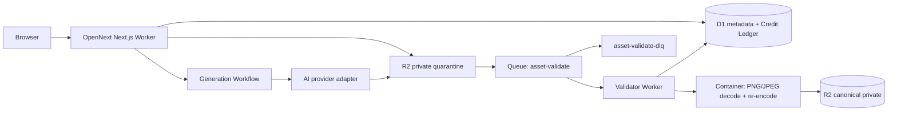

# Research — Deploy runtime & environment topology

**Date:** 2026-08-26
**Scope:** evidence for `.scratch/wayfinder/tickets/010-grilling-deploy-runtime.md`; official Cloudflare documentation, and official Vercel documentation only for the alternative comparison.
**Decision:** deploy the Next.js application with **OpenNext on Cloudflare Workers**, keep R2/D1/Queues there, and run the image validator in a bounded **Cloudflare Container**. Do not choose Vercel app + Cloudflare data/queue for this phase.

---

## 1. Recommendation

Use one Cloudflare platform per environment:

- The **OpenNext Worker** owns HTTP/SSR, BetterAuth, authorization, upload intents, D1 transactions and task creation. Use `nodejs_compat`; OpenNext explicitly does not support `export const runtime = "edge"`. Pin a compatibility date and upgrade it only through tested releases. [OpenNext get started](https://opennext.js.org/cloudflare/get-started) · [OpenNext troubleshooting](https://opennext.js.org/cloudflare/troubleshooting) · [Workers compatibility dates](https://developers.cloudflare.com/workers/configuration/compatibility-dates/)
- Cloudflare's current Next.js guide recommends **vinext for new applications** and retains OpenNext as the documented path for existing applications that cannot yet migrate. This project deliberately keeps OpenNext because the stack and origin parity are already locked, while treating a Linux production build/preview as a release gate. Switching to vinext requires a later compatibility comparison and ADR, not an implicit bootstrap change. [Cloudflare Next.js guide](https://developers.cloudflare.com/workers/framework-guides/web-apps/nextjs/) · [OpenNext supported surface](https://opennext.js.org/cloudflare)
- **R2 -> Queues -> validator** implements ADR 0003's storage-first quarantine. R2 event rules can filter by prefix/suffix and send object-create messages to a Queue; notification rate is 5,000 messages/sec/queue. The validator must remain idempotent because a duplicate event or retry is possible. [R2 event notifications](https://developers.cloudflare.com/r2/buckets/event-notifications/) · [Queues configuration](https://developers.cloudflare.com/queues/configuration/configure-queues/)
- The **validator is not a normal Worker**. A 50 MP raster can require roughly 191 MiB just for a 4-byte/pixel decoded frame, before decoder, input and output buffers. Workers have 128 MiB per isolate; Cloudflare's own image-transform tutorial warns that loading large files multiple times can reach this limit. A 50 MB/50 MP decode-and-re-encode contract is therefore *not safe to approve in Workers*, even if the 50 MB upload fits the Cloudflare request-size limits. [Workers limits](https://developers.cloudflare.com/workers/platform/limits/) · [Cloudflare Images/R2 transform guide](https://developers.cloudflare.com/images/tutorials/optimize-user-uploaded-image/)
- Run decode, dimension/pixel checks, metadata stripping and canonical PNG/JPEG write in a **Cloudflare Container** invoked by a thin Queue consumer/validator Worker. Containers are Workers-Paid-only, run beside Workers through a Durable Object, and can access R2/D1 bindings through outbound handlers. Start with `standard-1` (4 GiB RAM, 8 GB disk) and `max_instances` sized to the image/AI budget; it is a safety floor, not an autoscaling default. Container disk is ephemeral, so R2/D1 remain authoritative. [Containers overview](https://developers.cloudflare.com/containers/) · [instance limits](https://developers.cloudflare.com/containers/platform-details/limits/) · [binding integration](https://developers.cloudflare.com/containers/platform-details/workers-connections/)
- Run each accepted AI task as a **Cloudflare Workflow** keyed by immutable task ID. Workflow steps submit to the provider, sleep without holding request compute, poll/retry with bounded backoff, and hand provider output to R2 quarantine; D1 remains the task/hold source of truth. Workflows allow long-lived instances and sleeping/retry semantics without tying completion to the browser's 120-second poll window. [Workflows limits](https://developers.cloudflare.com/workflows/reference/limits/) · [sleeping and retrying](https://developers.cloudflare.com/workflows/build/sleeping-and-retrying/)

### Why not Vercel app + Cloudflare data/queue

Vercel Functions can be a valid escape hatch: Node functions have up to 4 GB memory on Pro/Enterprise and up to 800 s normally (1,800 s extended beta), so they can host an image validator that Workers cannot. But the app would still need Cloudflare R2 presign/event/Queue APIs and a separate worker/consumer path, adding cross-provider credentials, HTTP hops, incident ownership and deployment skew. Vercel preview deployments do **not** automatically isolate those external Cloudflare resources. With the product's R2-first design, the Cloudflare-only topology has one binding/identity/deploy/observability plane; Containers solve the only hard compute mismatch. [Vercel Functions limits](https://vercel.com/docs/functions/limitations) · [Vercel environment variables](https://vercel.com/docs/environment-variables)

**Trade-off:** Containers introduce Docker image supply chain, cold starts and separately metered CPU/memory/disk. Prefer Vercel only if a required native decoder/codec exceeds Container's current 12 GiB/4 vCPU/20 GB maximum or if a concrete Next dependency cannot run under OpenNext/Workers compatibility.

## 2. Region and data placement

- Keep HTTP Workers global. Do **not** enable Smart Placement just because D1 is bound: it optimizes measured backend latency, not data residency. Use it only after production traces show a material external-provider/D1 round-trip win, and re-measure. Explicit Worker placement hints are likewise latency hints, not sovereignty controls. [Workers Smart/explicit placement](https://developers.cloudflare.com/changelog/post/2026-01-22-explicit-placement-hints/)
- Create each environment's D1 primary with `--location=apac` for the expected Vietnam/SEA write path. A location hint is not a guarantee. If a legal requirement appears, choose a D1 jurisdiction at creation (it cannot be changed later); Workers can still access a jurisdiction-constrained DB globally, so pair it with Regional Services only if the response region itself must be controlled. [D1 data location](https://developers.cloudflare.com/d1/configuration/data-location/)
- Leave D1 read replication off in the first phase: BetterAuth, Credit Holds and idempotent task acceptance are write-sensitive, while the initial audience is APAC. Enable it only after measured read latency warrants the Sessions API and its sequential-consistency contract is covered by integration tests. [D1 read replication](https://developers.cloudflare.com/d1/best-practices/read-replication/)
- Constrain validator Containers to `APAC` where latency/processing locality matters; Containers support region and jurisdiction constraints. Do not claim that R2 object residency is region-pinned: this research found no official R2 regional-placement control suitable for that claim. [Container placement](https://developers.cloudflare.com/containers/platform-details/placement/)

## 3. Environment and preview topology

| Scope | Cloudflare account | Domain/Worker | D1 | R2 | Queues/Container | Data rule |
| --- | --- | --- | --- | --- | --- | --- |
| Development | `homedesign-dev` | protected `app-dev.<account>.workers.dev` | `hd-dev` | `hd-dev-private`, `hd-dev-public`, `hd-dev-next-cache` | `hd-dev-validate`, `hd-dev-dlq`, dev container | Synthetic only; local bindings default to simulations. |
| Staging | `homedesign-staging` | protected `app-staging.<account>.workers.dev` | `hd-staging` | `hd-staging-private`, `hd-staging-public`, `hd-staging-next-cache` | `hd-staging-validate`, DLQ, staging container/workflow | Seeded/disposable test data; no production export. |
| Production | `homedesign-prod` | apex/www, `cdn.<domain>`, share routes | `hd-prod` | `hd-prod-private`, `hd-prod-public`, `hd-prod-next-cache` | `hd-prod-validate`, DLQ, production container/workflow | Real user data only. |
| Pull-request preview | `homedesign-preview` | protected `pr-<n>-app.<account>.workers.dev` / unique Worker | `hd-pr-<n>` | `hd-pr-<n>-private/public/cache` | `hd-pr-<n>-validate`, DLQ; **no Container by default** | Ephemeral synthetic seed; automatic destroy on close/TTL. |

This is intentionally **four accounts**, not a shared staging-data preview model. Account separation is a recommended blast-radius and credential boundary; Wrangler environments alone create a separately named Worker but bindings, variables and secrets are non-inheritable and must be configured for every environment. Separate resource IDs/accounts make an accidental production binding materially harder. [Wrangler environments](https://developers.cloudflare.com/workers/wrangler/environments/) · [Workers local development and remote bindings](https://developers.cloudflare.com/workers/local-development/)

Preview policy:

1. Unit/local integration: simulated bindings by default; never use `remote: true` against production.
2. PR preview: CI provisions the per-PR D1/R2/Queues with a least-privilege token, runs migrations/seeds, deploys the uniquely configured Worker, and destroys resources on PR close plus a 72-hour janitor TTL. It may test magic-byte/intake metadata and use a mocked validator result; run real 50 MP decode only in staging.
3. Staging is the single production-like integration gate, not a mutable backing store for arbitrary PRs. Apply migrations there once, serialize destructive tests, and wipe/reseed only under an explicit test procedure.

Cloudflare version preview URLs are code previews, not a resource-isolation feature: versions retain their configured bindings. They are public when enabled and currently have no logs; Workers with Durable Objects/Containers do not get preview URLs. Therefore do not point a code-preview version at production resources, and do not make Containers a PR-preview requirement. [Preview URLs](https://developers.cloudflare.com/workers/versions-and-deployments/preview-urls/) · [Workers Builds](https://developers.cloudflare.com/workers/ci-cd/builds/)

## 4. Persistence, queues and lifecycle controls

- D1 migrations are checked-in sequential SQL and tracked in `d1_migrations`; use database name (not merely binding) in deployment commands. Production D1 Time Travel is always on and supports restore to any minute in the prior 30 days. Restore overwrites in place and cancels in-flight queries, so take the returned bookmark and use a change-freeze/runbook. [D1 migrations](https://developers.cloudflare.com/d1/reference/migrations/) · [Time Travel](https://developers.cloudflare.com/d1/reference/time-travel/)
- Queue payloads hold IDs, object key, ETag and attempt data—not image bytes (128 KB message maximum). Configure small batches (`1` initially for container work), explicit `max_concurrency`, `max_retries` (for example 5), retry delay, and a DLQ. Consumer execution has a 15-minute wall-clock limit and paid CPU is configurable up to five minutes; after retries the DLQ is mandatory because otherwise failed messages are eventually discarded. [Queues limits](https://developers.cloudflare.com/queues/platform/limits/) · [Queues configuration](https://developers.cloudflare.com/queues/configuration/configure-queues/)
- R2 lifecycle rules enforce ADR 0003 retention: `quarantine/`, abandoned intents and transient generated outputs expire after 24 hours; deletion/recovery jobs purge after the business 30-day recovery timer. Lifecycle action is asynchronous (typically within 24 h), so application authorization must hide/deactivate immediately and not wait for lifecycle deletion. [R2 object lifecycles](https://developers.cloudflare.com/r2/buckets/object-lifecycles/)

## 5. Release, observability, secrets and cost gates

**Release/rollback.** CI deploys a version only after migrations and smoke tests. Upload first, then promote; use gradual deployment for code-only compatible releases and pin service-binding calls if versions differ. Workers versions include code, static assets, bindings and compatibility settings, but **do not roll back D1/R2/DO state**—schema changes must be backward-compatible across the rollback window. Containers/DO lifecycle changes use the dedicated migration path and deserve a staging rehearsal. [Versions and deployments](https://developers.cloudflare.com/workers/versions-and-deployments/) · [deployment management](https://developers.cloudflare.com/workers/versions-and-deployments/deployment-management/) · [gradual deployments](https://developers.cloudflare.com/workers/versions-and-deployments/gradual-deployments/)

**Secrets.** Commit only names in Wrangler `secrets.required`; put values with the environment-specific secret command and use separate credentials for each account. Bindings and secrets are declared explicitly in every environment; no `vars` secrets and no `.dev.vars*`/`.env*` commit. The required-secrets declaration makes local/dev deploy fail rather than silently omit a secret. [Wrangler environments](https://developers.cloudflare.com/workers/wrangler/environments/) · [required secrets](https://developers.cloudflare.com/changelog/post/2026-03-24-secrets-config-property/)

**Observability.** Enable Workers Logs in each runtime, structured JSON with `request_id`, `asset_id`, `job_id`, `queue_attempt`, `worker_version` and no raw URLs/tokens/PII. Alert on worker errors/CPU, queue backlog/DLQ depth, validation rejection spikes, container start/exit and D1 overload. Keep 100% sampling in dev/staging; set an intentional production sampling rate and export OTLP/Logpush if retention beyond the native seven days is required. [Workers observability](https://developers.cloudflare.com/workers/observability/) · [Workers Logs](https://developers.cloudflare.com/workers/observability/logs/workers-logs/)

**Cost guardrails before build handoff.**

1. Workers Paid in the environments that use Containers; set `max_instances`, Queue `max_concurrency`, app upload-intent/user quotas from ADR 0003, and provider-side AI spend/rate limits.
2. Enable R2 prefix lifecycle rules and review storage, Class A/B operations, queue operations, Workers CPU and container provisioned-memory/disk separately. Container charges run while instances are awake; `sleepAfter` and bounded concurrency are real controls. [Containers pricing](https://developers.cloudflare.com/containers/pricing/) · [Cloudflare charge dimensions](https://developers.cloudflare.com/billing/understand/how-charges-accrue/)
3. Create low/medium/high Cloudflare budget alerts and per-product usage notifications; budget alerts are email-only and do **not** cap or pause usage, so the queue/container/user quotas above are mandatory. [Budget alerts](https://developers.cloudflare.com/billing/manage/budget-alerts/)

## 6. Open questions to close in the build ADR

- Benchmark the selected decoder in `standard-1` on adversarial 50 MB/50 MP PNG and JPEG, measure peak RSS, CPU, wall time and cold-start p95. Raise instance type only from evidence; reject images before decode when dimensions/header claims violate policy.
- Verify the exact OpenNext/Next.js version, native dependencies and BetterAuth database adapter in a production-mode build. The official OpenNext docs document Worker compatibility constraints but cannot prove this repository's dependency graph.
- Decide the real data-residency/compliance requirement. `apac` is only a D1 location hint; R2 residency was not established by the official sources consulted.
- Write the CI provision/destroy contract for PR resources and the migration compatibility/restore runbook before enabling public previews.
